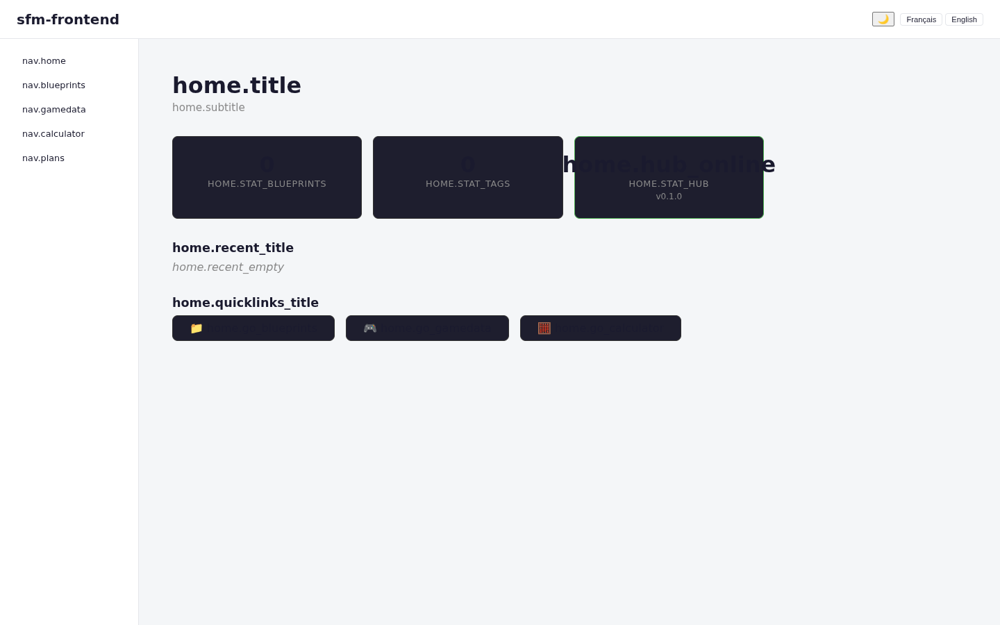

# satisfactory-factory-manager

[](https://github.com/chrysa/satisfactory-factory-manager/actions/workflows/ci.yml)

Factory planning tool for [Satisfactory](https://www.satisfactorygame.com/) — replaces spreadsheets with an interactive production chain optimizer, resource flow visualizer, and AI-powered assistant.



## Stack

| Layer     | Tech                                                          |
|-----------|---------------------------------------------------------------|
| Backend   | FastAPI + Python 3.12 (async)                                |
| Frontend  | React 19 + TypeScript 5 (strict) + Vite 6                   |
| Styling   | Tailwind CSS v4 + shadcn/ui                                  |
| Graph viz | ReactFlow (factory node graph)                                |
| AI        | ai-aggregator (chrysa) — local Ollama fallback               |
| Database  | SQLite (local-first) → Postgres if multi-user                |
| Container | Docker (multi-stage), Traefik reverse proxy                  |
| CI        | GitHub Actions (chrysa/github-actions reusable workflows)    |

## Status

> Early stage — no application code yet. Scaffold to be generated from:
> - Backend: `chrysa/project-init` Python template
> - Frontend: `Forge-Stack-Workshop/react-app-generator`

## Quickstart

```bash
make install       # Install dependencies
make dev           # Start backend + frontend
make test          # Run tests (via Docker)
```

## License

MIT
